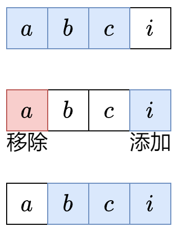

# 滑动窗口


## [一、 定长滑动窗口](./一_定长滑动窗口/README.md)



**算法的流程主要是通过维护一个固定的数组大小以模拟一个窗口中内容的进出**

[*模板题*](https://leetcode.cn/problems/maximum-number-of-vowels-in-a-substring-of-given-length/solutions/2809359/tao-lu-jiao-ni-jie-jue-ding-chang-hua-ch-fzfo/)

题目：{#fixed_length_window_example}
给你字符串 s 和整数 k 。
请返回字符串 s 中长度为 k 的单个子字符串中可能包含的最大元音字母数。
英文中的 元音字母 为（a, e, i, o, u）。

```python
def maxVowels(self, s: str, k: int) -> int:
    ans = vowel = 0 
    '''
    一次性定义两个变量，左边变量用以保存最终的答案，右侧的变量用来保存当前窗口中的值
    '''
    for i, c in enumerate(s):
        '''
        在Python3中 enumerate 函数的用法如下：
        函数的定义：enumerate(iterable, start=0)
        
        输入参数
        -（iterable: 需要遍历的序列（如列表、元组、字符串等）。
        -start: 索引的起始值，默认为 0。）

        返回值
        返回一个枚举对象，其中每个元素是一个包含索引和对应值的元组，如：（index, value）

        因此这里的 i 表示遍历到当前的 s 字符串的字符索引， c 表示被遍历的字符的值
        '''

        # 字符入窗
        if c in "aeiou":
            vowel += 1
        
        # 计算 left 的值
        left = i - k + 1

        # 当left >= 0 表示当前窗口大于等于了k的值
        if left < 0:
            continue
        
        '''
        每次出窗口之前先更新 ans 的值，因为第一次进入这里的时候是窗口刚好为K大小，且每次
        比较完之后都会将左侧的窗口端点的值出窗，因此先进行大小比较
        '''
        ans = max(ans, vowel)

        if s[left] in 'aeiou':
            vowel -= 1
        
    return ans
```


