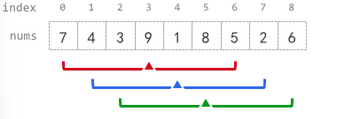

# [2090. 半径为 k 的子数组平均值](https://leetcode.cn/problems/k-radius-subarray-averages/description/)

题目：

给你一个下标从 0 开始的数组 nums ，数组中有 n 个整数，另给你一个整数 k 。

半径为 k 的子数组平均值 是指：nums 中一个以下标 i 为 中心 且 半径 为 k 的子数组中所有元素的平均值，即下标在 i - k 和 i + k 范围（含 i - k 和 i + k）内所有元素的平均值。如果在下标 i 前或后不足 k 个元素，那么 半径为 k 的子数组平均值 是 -1 。

构建并返回一个长度为 n 的数组 avgs ，其中 avgs[i] 是以下标 i 为中心的子数组的 半径为 k 的子数组平均值 。

x 个元素的 平均值 是 x 个元素相加之和除以 x ，此时使用截断式 整数除法 ，即需要去掉结果的小数部分。

例如，四个元素 2、3、1 和 5 的平均值是 (2 + 3 + 1 + 5) / 4 = 11 / 4 = 2.75，截断后得到 2 。

示例1：
---

    输入：nums = [7,4,3,9,1,8,5,2,6], k = 3
    输出：[-1,-1,-1,5,4,4,-1,-1,-1]
    解释：

    - avg[0]、avg[1] 和 avg[2] 是 -1 ，因为在这几个下标前的元素数量都不足 k 个。
    - 中心为下标 3 且半径为 3 的子数组的元素总和是：7 + 4 + 3 + 9 + 1 + 8 + 5 = 37 。使用截断式 整数除法，avg[3] = 37 / 7 = 5 。
    - 中心为下标 4 的子数组，avg[4] = (4 + 3 + 9 + 1 + 8 + 5 + 2) / 7 = 4 。
    - 中心为下标 5 的子数组，avg[5] = (3 + 9 + 1 + 8 + 5 + 2 + 6) / 7 = 4 。
    - avg[6]、avg[7] 和 avg[8] 是 -1 ，因为在这几个下标后的元素数量都不足 k 个。


```python
class Solution:
    def getAverages(self, nums: List[int], k: int) -> List[int]:
        window_sum = 0 # 记录窗口中的数总和
        ans = [-1] * len(nums) # 使用 -1 初始化数组

        for i, num in enumerate(nums): # enumerate函数遍历数组
            window_sum += num # 每次都入窗口

            left = i - 2 * k # 计算left下标，因为是以求以k为半径，因此 left 不加 1
            if left < 0: # 如果没有形成半径为 k 的圆则再次进入循环
                continue
            avg = window_sum // ((2 * k) + 1) # 计算平均值， python3 中， 一个 / 表示浮点数计算， 两个 / 号表示整除
            ans[left + k] = avg # 圆的中心点位置设置值
            window_sum -= nums[left] # 出窗口
        return ans
```
灵神版本

```python
class Solution:
    def getAverages(self, nums: List[int], k: int) -> List[int]:
        avgs = [-1] * len(nums)
        s = 0  # 维护窗口元素和
        for i, x in enumerate(nums):
            # 1. 进入窗口
            s += x
            if i < k * 2:  # 窗口大小不足 2k+1
                continue
            # 2. 记录答案
            avgs[i - k] = s // (k * 2 + 1)
            # 3. 离开窗口
            s -= nums[i - k * 2]
        return avgs
```